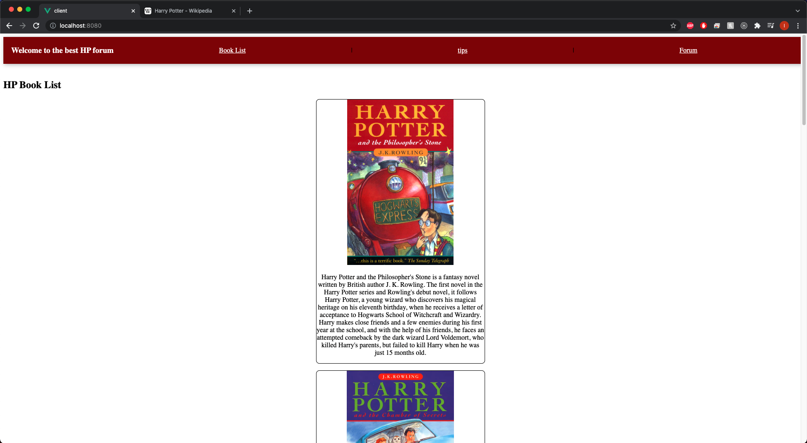
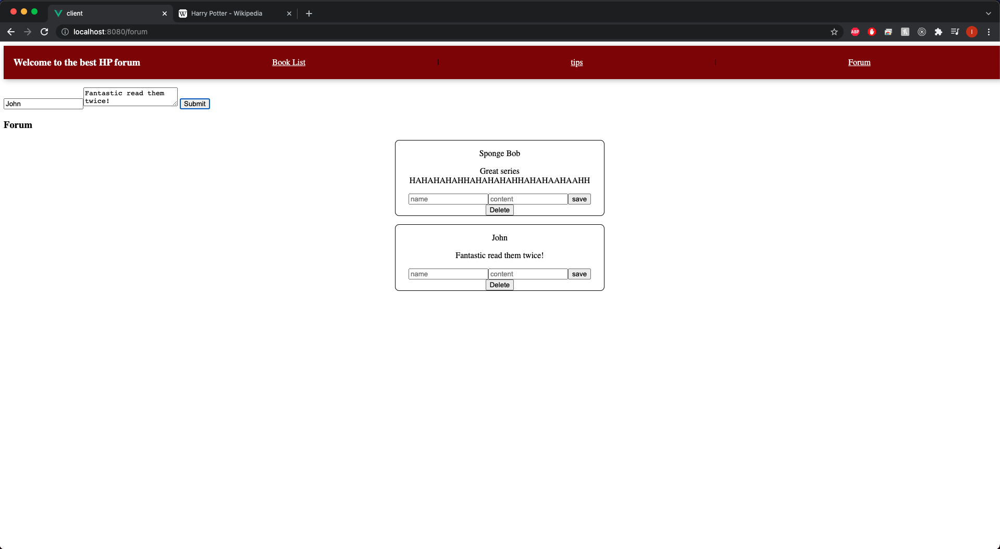
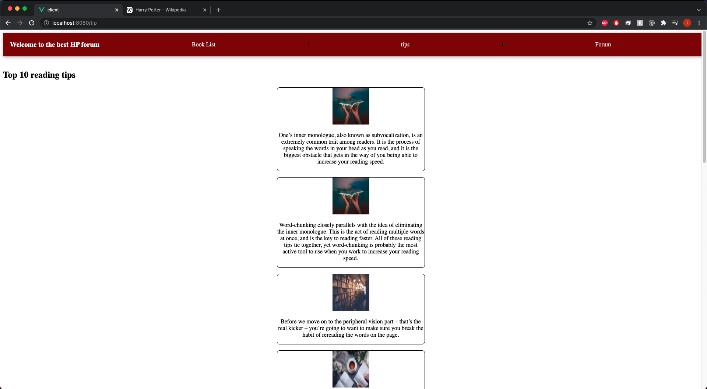

> # **_HP Forums_**

#### By: Itallo Gama

#### 10/18/2021

 [ GitHub](https://github.com/ItalloGama) | [ LinkedIn](https://www.linkedin.com/in/itallo-gama/)|

> ## Getting Started

- Clone down the repository
- Use "npm start serve" to start the front-end
- Use "npm run dev" to start the back-end

> ## _Technologies used_

- Postres
- VUE
- Node
- Heroku

> ## _Details_

 **_HP Forums_** is a website for Harry Potter fans. Here you will be able to see the series in order, and also submit your own posts in out HP fan **_forum_**. HP Forums also contains some of the best reading tips for avid readers and beginner alike.

> ## _Screenshots_
>
> 

> ## _Credits_

- [Stack Overflow](https://stackoverflow.com/)
- [Wikipedia](https://en.wikipedia.org/)
- [Unsplash](https://unsplash.com/)
